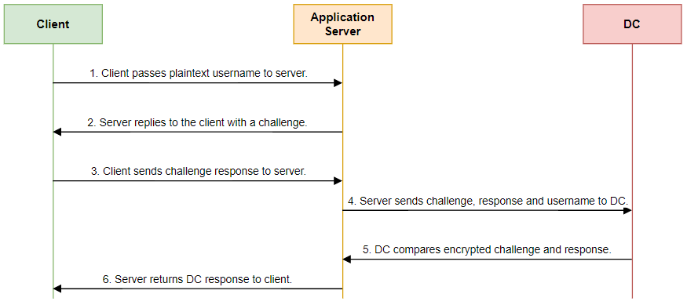
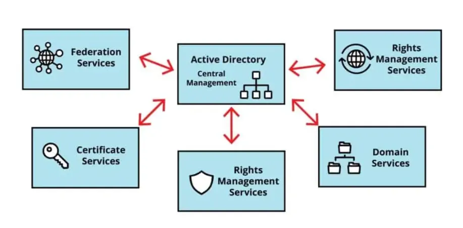

# Introduction
Active Directory (AD) est un annuaire de services développé par Microsoft pour les réseaux Windows. Il fournit diverses méthodes pour stocker des informations sur une organisation et offre une variété de fonctionnalités pour aider à gérer ce réseau, notamment en matière d'authentification et d'autorisation.

# Authentification et Active Directory
L'authentification est un processus vital qui garantit qu'une personne ou un système est celui qu'il prétend être. Cela implique généralement de vérifier un nom d'utilisateur et un mot de passe. Active Directory joue un rôle central dans ce processus sur les réseaux Windows.

## Évolution Historique de l'Authentification

### SAM (Security Account Manager)

Historiquement, le modèle d'authentification SAM a été utilisé pour gérer les comptes d'utilisateurs et les mots de passe sur les systèmes Windows. Les mots de passe étaient stockés sous forme de hachages et vérifiés localement.

- **Construction du hash** :

**LM hash** : Créé en divisant le mot de passe en deux morceaux de 7 caractères, puis en les hachant séparément.

**NT hash** : Utilise MD4 pour hacher le mot de passe Unicode.

- **Chemin d'authentification** :
    - L'utilisateur saisit les identifiants.
    - Les hash LM et NT sont créés.
    - Ces hash sont stockés localement dans la base de données SAM sur l'ordinateur.

- **Utilisation ultérieure** :

Les hash sont comparés aux hash stockés lors de tentatives d'authentification ultérieures.

### NTLM (NT LAN Manager)
**NTLM** est venu remplacer **SAM** en ajoutant une sécurité supplémentaire. Et un hash HMAC-MD5 pour NTLMv2.

- **Construction du hash** :

**NTLMv2** utilise le NT hash et un "blob" contenant des informations sur le client et le serveur.

Chemin d'authentification :

- L'utilisateur saisit les identifiants.
- Le client envoie une demande au serveur.
- Le serveur envoie un défi au client.
- Le client répond en utilisant le hash NTLMv2.
- Le serveur vérifie le hash avec la version stockée dans l'Active Directory.

- **Utilisation ultérieure** :

Le hash est utilisé pour valider l'authenticité de l'utilisateur lors de sessions ultérieures.

### Kerberos
Kerberos, basé sur le protocole Needham-Schroeder, est devenu le protocole d'authentification standard avec l'introduction d'Active Directory. Il utilise une approche basée sur des tickets pour garantir la sécurité et fonctionne comme suit:
Kerberos utilise des algorithmes de chiffrement comme AES ou DES pour créer des tickets chiffrés.

- **Authentification Initiale** : L'utilisateur s'authentifie auprès de l'AS (Authentication Server), qui renvoie un TGT (Ticket Granting Ticket).
- **Demande de Ticket de Service** : Le TGT est envoyé au TGS (Ticket Granting Server) avec une nouvelle demande de ticket de service pour une ressource spécifique.
- **Accès à la Ressource** : Le TGS renvoie le ticket de service, qui est présenté à la ressource cible, permettant l'accès.

## Organisation : 

### Structure du Domaine
L'Active Directory ne se préoccupe pas de la topologie du réseau ni des DC (Domain Controllers), il structure simplement les ressources de manière logique. Ainsi, plutôt que de trouver des ressources par leur emplacement physique, AD les trouve par leur nom, en suivant la structure hiérarchique suivante :

- **Forêt** : Une forêt est la collection d'un ou plusieurs arbres AD, c'est le conteneur supérieur dans la structure hiérarchique et crée une séparation logique entre les arbres. Le premier domaine créé dans AD générera automatiquement une forêt. Une forêt peut avoir un ou plusieurs arbres avec un ou plusieurs domaines, et les arbres au sein de la forêt partagent le même schéma, ce qui signifie que tout le contenu des objets sera répliqué dans tous les domaines de la forêt. Les domaines au sein d'une forêt se font confiance par défaut.
- **Arbre** : Il s'agit d'une série de domaines connectés de manière hiérarchique, tous utilisant le même espace de noms DNS. Ils font partie du même arbre de domaine, et une confiance est automatiquement créée entre les domaines parent et enfant. Par exemple, si "mirage.net" était ajouté à un domaine appelé "dev", il serait nommé "dev.mirage.net".
- **Domaine** : Les domaines sont des unités logiques de conteneurs et d'objets au sein d'Active Directory. Un domaine contient une structure hiérarchique pour les utilisateurs, les groupes, les ordinateurs, et comprend également un nom DNS pour identifier le domaine, des politiques applicables aux utilisateurs, aux groupes et aux ordinateurs, des services de sécurité fournissant l'authentification et l'autorisation aux ressources dans le domaine et d'autres domaines. Un domaine peut avoir plusieurs sous-domaines (également connus sous le nom de Domaines Enfants).

### Objets Active Directory

Les objets dans AD sont des ressources représentant quelque chose sur un réseau, tels que les utilisateurs, les groupes, les ordinateurs, les imprimantes, les dossiers partagés ou les applications. Ces objets peuvent être placés dans des domaines et des OU. Examinons chaque type d'objet.

- **OU** : Une OU (Unité d'Organisation) est un objet pouvant contenir différents objets du même domaine. Vous pouvez utiliser les OU pour stocker et gérer des utilisateurs, des contacts, des ordinateurs et des groupes. Les OU sont également utilisées pour appliquer des paramètres de stratégie de groupe et des permissions à l'ensemble du conteneur.
- **Users** : Ce sont des objets attribués à des individus pour accéder aux ressources du domaine. Les utilisateurs peuvent également être utilisés pour exécuter des programmes ou des services système.
- **Groups** : Ces objets sont un ensemble d'utilisateurs, d'ordinateurs ou de contacts. Il existe deux types de groupes :
    - Sécurité : C'est un groupe d'objets qui peut être utilisé pour attribuer des ressources ou appliquer des permissions.

    - Distribution : Ces groupes sont utilisés par les applications de messagerie pour envoyer un e-mail à un groupe d'utilisateurs.
- **Computers** : Cela représente les autres ordinateurs qui sont joints au domaine.
- **Contacts** : Cet objet contient des informations sur les contacts tiers. Il n'est pas possible de se connecter au domaine avec cet objet, qui n'a pas de SID et ne peut pas être utilisé pour sécuriser les permissions.
- **Printers** : Ces objets sont des imprimantes partagées au sein du domaine.

### FSMO

Les FSMO - *Flexible Single Master Operation* sont des rôles. Ces rôles permettent l'authentification des DC et accordent des permissions. L'authentification et l'autorisation sont séparées en différents rôles et peuvent être réparties sur plusieurs DC pour obtenir de meilleures performances et une bascule en cas de panne d'un DC.

Il y a 5 rôles **FSMO** :

- **Schema Master** : C'est un rôle à l'échelle de la forêt qui gère toutes les modifications apportées au schéma Active Directory. Il n'y en a qu'un dans toute la forêt.
- **Domain Naming Master** : C'est un rôle à l'échelle de la forêt chargé de gérer les noms de domaine. Il n'y en a qu'un dans toute la forêt.
- **PDC Emulator** : « Émulateur de contrôleur de domaine principal », le DC avec le rôle d'émulateur PDC est le DC ayant la plus haute autorité au sein du domaine. Ce rôle gère les demandes d'authentification, les changements de mot de passe, les verrouillages d'utilisateurs, les stratégies de groupe et est le serveur de temps pour les clients. C'est un rôle à l'échelle du domaine.
- **RID Master** : Le rôle de maître « Identifiant Relatif » est chargé de conserver des blocs de SIDs et de les attribuer à différents DC au sein du domaine. Il veille également à ce que les objets ne se voient pas attribuer le même SID et RID. Lorsqu'un objet est créé, il reçoit un SID unique et un identifiant relatif. C'est un rôle à l'échelle du domaine.
- **Infrastructure Master** : Ce rôle est utilisé pour référencer les objets dans d'autres domaines. Il traduit les GUID, SIDs, et DNs entre les domaines. Si les utilisateurs du domaine A sont membres d'un groupe de sécurité dans le domaine B, le rôle de maître d'infrastructure est utilisé pour référencer les comptes dans le domaine correct. C'est un rôle à l'échelle du domaine.

### Autres Services Active Directory
AD propose d'autres services liés aux permissions, aux identités et aux ressources réseau, dont les suivants :

- **Active Directory Domain Services (AD DS)** :
C'est le service le plus couramment utilisé, il offre des capacités de stockage et de gestion des données d'annuaire. Dans cet article, nous avons décrit ce que c'est, à quoi il sert et quelles informations il peut stocker.
- **Active Directory Certificate Services (AD CS)** :
Il s'agit d'un rôle de serveur qui permet aux gestionnaires de générer et de gérer une Infrastructure à Clé Publique (PKI) et de fournir des certificats et signatures numériques pour votre organisation. Ce rôle vous permet de définir des rôles et des politiques dans le but de créer, gérer, distribuer, utiliser, stocker, révoquer des certificats et des clés publiques, chiffrer le trafic réseau et authentifier les utilisateurs et les ordinateurs.
- **Active Directory Federation Services (AD FS)** :
Ce service est une solution de gestion d'identité. Il permet l'authentification unique sur des sites web et des applications externes en utilisant l'authentification unique (SSO), de sorte que les utilisateurs n'ont besoin de retenir qu'un ensemble d'identifiants pour les utiliser à plusieurs endroits. Office 365 est une utilisation courante des services de fédération.
- **Active Directory Lightweight Directory Services (AD LDS)** :
Ce service fournit des services d'annuaire en utilisant le protocole LDAP sans déployer de DC. Il est complètement indépendant des limitations de domaine de l'AD DS et n'est pas limité à l'AD, ses forêts et ses domaines. Ce service peut fonctionner sur n'importe quel serveur autonome et fournit son propre espace de stockage de données.
- **Active Directory Rights Management Services (AD RMS)** :
Ce service est une solution de contrôle d'accès aux données. Il fournit des méthodes pour protéger le contenu numérique tel que les documents, les e-mails, les documents Office et les pages web en définissant qui peut les ouvrir, les modifier, les imprimer, les transférer ou entreprendre d'autres actions.

## Nomenclature

- **AD** : Abréviation de « Active Directory ».
- **AD DS** : « Active Directory Domain Services », cela fait référence à un serveur qui l'exécute.
- **DC** : « Domain Controller », il fait référence à un serveur exécutant le rôle AD DS, la fonction principale d'un contrôleur de domaine est d'authentifier et d'autoriser les utilisateurs et leurs ressources dans un réseau de domaine.
- **DNS** : Abréviation de « Domain Name System », AD DS utilise les services de résolution de noms DNS pour que les clients puissent localiser les DC et pour que les DC qui hébergent le service d'annuaire puissent communiquer entre eux. Vous pouvez en savoir plus sur DNS ici.
- **GC** : « Global Catalog » est un service de stockage de données pour un DC, par défaut, le premier DC d'un domaine est désigné comme serveur GC, un DC exécutant le GC est connu sous le nom de Global Catalog Server, le serveur GC stocke des copies de tous les objets dans un domaine et est utilisé pour effectuer des recherches dans la forêt.
- **Schéma** : C'est un plan qui définit comment les objets peuvent être créés, stockés et utilisés dans AD, chaque objet est une instance d'une classe et chaque classe a ses propres attributs et syntaxe. Si vous créez un « objet Ordinateur », cet objet est une instance de la « classe Ordinateur ».
- **RODC** : « Read-Only Domain Controller » est le serveur qui détient une base de données AD en lecture seule et ne permet pas de modifications, son but est d'améliorer la sécurité physique.
- **FQDN** : « Fully Qualified Domain Name » est un nom composé d'un nom d'hôte et du nom de domaine, par exemple, le FQDN pour un objet ordinateur nommé « server1 » dans le domaine « mirage.net » serait « server1.mirage.net ».
- **FSMO** : « Flexible Single Master Operation » sont des rôles installés sur le premier DC lorsqu'une nouvelle forêt est créée.
- **LDAP** : « Lightweight Directory Access Protocol » est un protocole ouvert qui fournit un mécanisme de communication pour les applications et les systèmes utilisés pour accéder aux services d'annuaire et les authentifier, supporte l'authentification Kerberos, SASL (Simple Authentication Security Layer), SSL (Secure Sockets Layer), fonctionne avec un modèle client/serveur et fonctionne sur TCP/IP. En termes simples, LDAP est une manière de communiquer avec AD.
- **ADWS** : « Active Directory Web Services » est un service qui permet la gestion à distance des domaines de l'annuaire local et des instances ADLDS, il est installé automatiquement avec le rôle ADDS ou ADLDS et utilise le protocole WebSocket sur le port 9389.
- **Corbeille AD** : cette fonctionnalité vous permet de restaurer des objets supprimés, elle n'est pas activée par défaut, mais vous pouvez apprendre comment l'activer ici.
- **SYSVOL** : Stocke les informations de l'AD et les réplique vers d'autres DC, c'est un dossier partagé et son emplacement par défaut est %SYSTEMROOT%\SYSVOL\sysvol.

## Documentation

- [Setup un AD sur un windows server 2022](https://infrasos.com/how-to-setup-active-directory-on-windows-server-2022/)
- [Exploit classiques sur l'AD](https://tryhackme.com/room/postexploit)
- [AD Checklist CERT-FR](https://www.cert.ssi.gouv.fr/uploads/ad_checklist.html)
- [Best practices AD selon Microsoft](https://learn.microsoft.com/fr-fr/windows-server/identity/ad-ds/plan/security-best-practices/best-practices-for-securing-active-directory)
