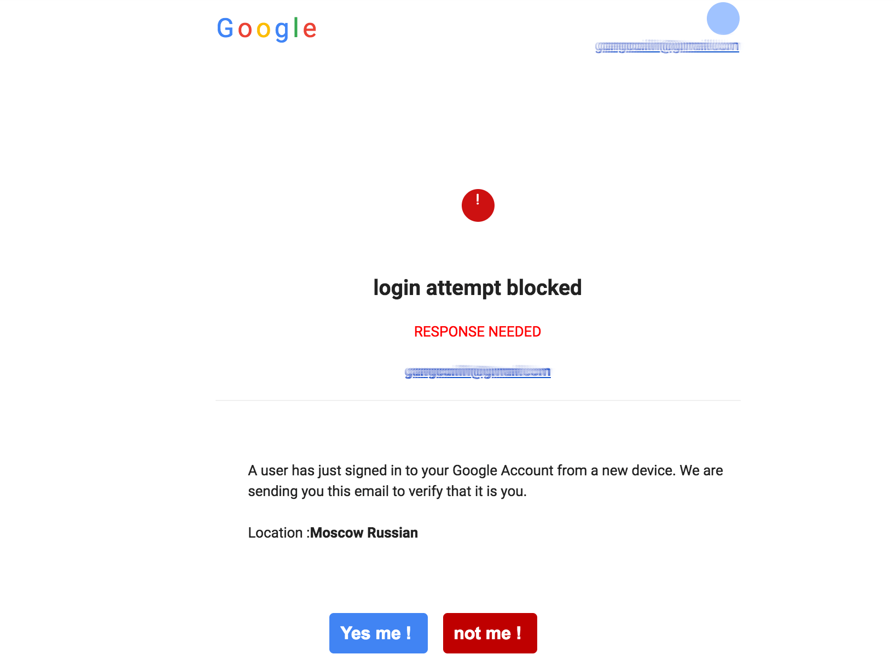
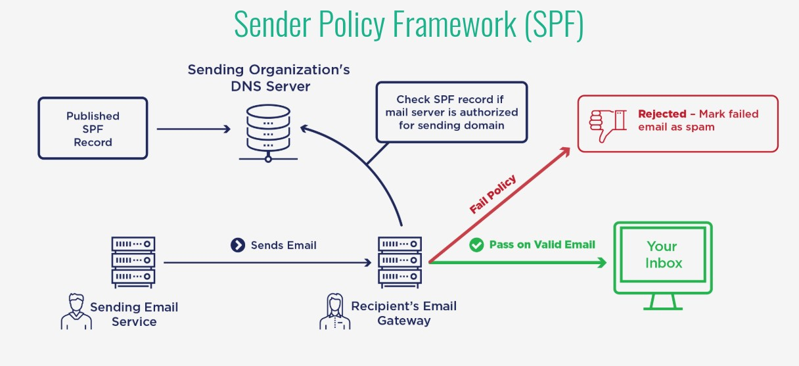

## Introduction
### Contexte
Dans notre monde numérique, la sécurité des e-mails est devenue une préoccupation majeure. Les e-mails sont souvent la cible d'attaques telles que l'usurpation d'identité et le phishing, où les attaquants se font passer pour des entités légitimes pour tromper les destinataires. Ces attaques peuvent entraîner des pertes financières, des atteintes à la réputation et des violations de données.

### Comment arrêter l'email spoofing/phishing ?
Arrêter l'usurpation d'identité et le phishing nécessite une combinaison de mesures de sécurité, notamment l'implémentation de protocoles tels que SPF, DKIM et DMARC. Ces protocoles authentifient les e-mails et empêchent les attaquants de se faire passer pour des expéditeurs légitimes.

L'exemple ci-dessous par exemple est un cas réel de phishing où l'attaquant fait croire à l'utilisateur qu'il a une connexion possible sur son compte Google et demande la validation ou non qui sera suivie d'une page de re-connexion. Ainsi il pourra récupérer à la fois les identifiants mais aussi par le biais d'un outil tel que [`evilginx2`](https://github.com/kgretzky/evilginx2) par exemple bypass la double authentification.

### Fonctionnement du SMTP (explication de l'envoi d'un email à la réception)
SMTP (**Simple Mail Transfer Protocol**) est le protocole standard pour l'envoi d'e-mails.
An SMTP server is an application or computer that sends, receives and relays email. These servers typically use TCP on port 25 or 587.

Le protocole **SMTP** (Simple Mail Transfer Protocol) est au cœur de la communication par e-mail. Un serveur **SMTP** est une application ou un ordinateur qui envoie, reçoit et relaie les e-mails, utilisant généralement le TCP sur les ports 25 ou 587.
Ces serveurs sont toujours à l'écoute et initient une connexion au port 25 dès qu'ils détectent une connexion TCP d'un client pour envoyer l'e-mail. Les serveurs SMTP sortants envoient des messages pour les utilisateurs, et les clients de messagerie, qui sont utilisés pour lire et envoyer des e-mails, doivent également avoir l'adresse IP du serveur SMTP. Pour gérer des problèmes tels que le spam, les administrateurs de serveurs doivent contrôler quels clients peuvent utiliser le serveur, soit en restreignant les utilisateurs par leur adresse IP, soit en imposant une authentification.

Le fonctionnement de **SMTP** suit un modèle client-serveur, en suivant le schéma suivant :
- Un serveur de messagerie utilise SMTP pour envoyer un message d'un client de messagerie à un autre serveur de messagerie, puis utilise SMTP comme service de relais pour envoyer l'e-mail au serveur de messagerie récepteur. 
- Le serveur récepteur utilise ensuite un client de messagerie pour télécharger le courrier entrant via IMAP, par exemple, et le place dans la boîte de réception du destinataire.
- Lorsqu'un utilisateur clique sur le bouton "envoyer", une connexion TCP est établie qui se lie à un serveur SMTP. 
- De là, le client SMTP indique au serveur quoi faire avec des informations telles que les adresses e-mail de l'expéditeur et du destinataire et le contenu de l'e-mail.
- Un agent de transfert de courrier (MTA) vérifie ensuite si les deux adresses e-mail sont du même domaine.
- Si c'est le cas, l'e-mail est envoyé ; sinon, le serveur utilise le système de noms de domaine (DNS) pour identifier le domaine du destinataire et l'envoie au serveur correct.
- Le destinataire utilise ensuite les protocoles IMAP ou **POP3** pour recevoir l'e-mail.

## Définition des termes
- **SMTP** (Simple Mail Transfer Protocol) : est un protocole utilisé pour envoyer des e-mails d'un serveur à un autre. Il fonctionne en établissant une connexion TCP avec le serveur de messagerie du destinataire, généralement sur les ports 25 ou 587, et en relayant l'e-mail. SMTP est responsable de l'envoi d'e-mails, mais pas de leur réception.
- **POP3** (Post Office Protocol 3) : est un protocole utilisé pour récupérer les e-mails d'un serveur de messagerie. Contrairement à IMAP, POP3 télécharge les e-mails sur l'appareil du client et les supprime généralement du serveur. Cela signifie que les e-mails ne sont pas synchronisés entre différents appareils, et une fois téléchargés, ils ne sont disponibles que sur l'appareil qui les a téléchargés.
- **IMAP** (Internet Mail Access Protocol) : est un protocole qui permet aux clients de messagerie de récupérer des messages d'un serveur de messagerie. Contrairement à POP3, IMAP laisse les messages sur le serveur, permettant une synchronisation entre différents appareils. Cela signifie que vous pouvez accéder à vos e-mails depuis n'importe quel appareil, et les actions telles que la suppression ou le marquage d'un e-mail sont reflétées sur tous les appareils.
- **SPF** (Sender Policy Framework) : est un protocole de sécurité e-mail qui aide à prévenir l'usurpation d'identité. Il fonctionne en vérifiant l'adresse IP de l'expéditeur contre une liste d'adresses IP autorisées dans un enregistrement DNS du domaine de l'expéditeur. Si l'adresse IP correspond, l'e-mail est considéré comme légitime. Cela empêche les attaquants de se faire passer pour des expéditeurs légitimes.
- **DKIM** (DomainKeys Identified Mail) : est un autre protocole de sécurité e-mail qui authentifie les e-mails en ajoutant une signature cryptographique à l'en-tête de l'e-mail. Le serveur du destinataire compare cette signature avec une clé publique dans le DNS de l'expéditeur pour vérifier l'authenticité de l'e-mail. Cela assure que l'e-mail n'a pas été modifié en cours de route et renforce la légitimité de l'expéditeur.
- **DMARC** (Domain-based Message Authentication, Reporting & Conformance) : est un protocole qui utilise SPF et DKIM pour authentifier les e-mails et fournit des rapports sur les tentatives d'usurpation d'identité. Il fonctionne en vérifiant les résultats des contrôles SPF et DKIM et en appliquant une politique spécifiée par l'expéditeur, comme rejeter ou mettre en quarantaine les e-mails échouant aux contrôles. DMARC offre une protection complète et fournit des informations détaillées sur les tentatives d'usurpation d'identité, aidant ainsi les organisations à protéger leurs communications par e-mail.

## SPF
### Fonctionnement
SPF fonctionne en comparant l'adresse IP de l'expéditeur avec une liste d'adresses IP autorisées dans un enregistrement DNS du domaine de l'expéditeur. Si l'adresse IP correspond, l'e-mail est considéré comme légitime.

### Avantages de SPF
- **Prévention de l'usurpation d'identité** : Bloque les e-mails provenant d'expéditeurs non autorisés.
- **Amélioration de la délivrabilité** : Réduit la probabilité que les e-mails légitimes soient marqués comme spam.

### Mise en oeuvre de SPF
- **Identifier les serveurs autorisés** : Liste des adresses IP autorisées à envoyer des e-mails pour votre domaine.
- **Créer un enregistrement SPF** : Ajouter un enregistrement SPF à votre DNS avec les adresses IP autorisées.
- **Tester l'enregistrement SPF** : Utiliser des outils de test pour vérifier que l'enregistrement SPF fonctionne correctement.

`v=spf1 ip4:1.2.3.4 ip4:2.3.4.5`

## DKIM
### Fonctionnement
**DKIM** fonctionne en ajoutant une signature cryptographique à l'en-tête de l'e-mail. Le serveur du destinataire compare cette signature avec une clé publique dans le DNS de l'expéditeur pour vérifier l'authenticité de l'e-mail.

### Avantages de DKIM
- **Authentification des e-mails** : Assure que l'e-mail n'a pas été modifié.
- **Renforcement de la réputation** : Aide à établir la légitimité de l'expéditeur.

### Mise en oeuvre de DKIM
- **Générer une paire de clés** : Créer une clé privée pour signer les e-mails et une clé publique à publier dans le DNS.
- **Configurer le serveur de messagerie** : Configurer votre serveur de messagerie pour signer les e-mails avec la clé privée.
- **Publier la clé publique** : Ajouter un enregistrement DKIM à votre DNS avec la clé publique.
- **Tester la configuration** : Utiliser des outils de test pour vérifier que DKIM fonctionne correctement.

Pour postfix par exemple, l'idéal c'est d'utiliser la CLI `opendkim` comme indiqué sur le tutorial [suivant](https://easydmarc.com/blog/how-to-configure-dkim-opendkim-with-postfix/)

## DMARC
### Fonctionnement
DMARC fonctionne en vérifiant les résultats des contrôles SPF et DKIM et en appliquant une politique spécifiée par l'expéditeur (comme rejeter ou mettre en quarantaine les e-mails échouant aux contrôles).

### Avantages de DMARC
- **Protection complète** : Utilise SPF et DKIM pour une authentification robuste.
- **Rapports détaillés** : Fournit des informations sur les tentatives d'usurpation d'identité.

### Mise en oeuvre de DMARC postfix
- **Configurer SPF et DKIM** : Assurez-vous que SPF et DKIM sont correctement configurés.
- **Créer une politique DMARC** : Définir une politique DMARC (rejeter, mettre en quarantaine ou aucun) et les adresses de rapport.
- **Ajouter un enregistrement DMARC** : Ajouter un enregistrement DMARC à votre DNS avec la politique et les adresses de rapport.
- **Surveiller les rapports** : Analyser les rapports DMARC pour détecter et réagir aux tentatives d'usurpation d'identité.

Pour postfix par exemple, l'idéal c'est d'utiliser la CLI `opendmarc` comme indiqué sur le tutorial [suivant](https://www.linuxbabe.com/mail-server/opendmarc-postfix-ubuntu)

## Meilleures pratiques et outils
### Combinaison SPF, DKIM et DMARC
Utiliser **SPF**, **DKIM** et **DMARC** ensemble offre une protection complète contre l'usurpation d'identité et le phishing. Chaque protocole ajoute une couche de sécurité, et leur combinaison assure que les e-mails sont à la fois authentifiés et non altérés.

### Outils et services
Il existe de nombreux outils et services qui facilitent la mise en œuvre de SPF, DKIM et DMARC, tels que des vérificateurs d'enregistrement, des générateurs de clés et des plateformes de surveillance.

Pour SPF :
- [mxtoolbox](https://mxtoolbox.com/spf.aspx)
- [check](https://www.kitterman.com/spf/validate.html)

Pour DKIM :
- [mxtoolbox](https://mxtoolbox.com/dkim.aspx)
- [ietf](https://authors.ietf.org/)

Pour DMARC :
- [mxtoolbox](https://mxtoolbox.com/dmarc.aspx)
- [mimecast](https://www.mimecast.com/products/dmarc-analyzer/dmarc-check/)

### Conseils et astuces
- **Tester avant de déployer** : Utilisez des outils de test pour vérifier vos configurations avant de les mettre en production.
- **Surveiller régulièrement** : Surveillez vos rapports et vos journaux pour détecter rapidement les problèmes.
- **Mettre à jour les enregistrements** : Gardez vos enregistrements SPF, DKIM et DMARC à jour pour refléter les changements dans vos serveurs de messagerie.