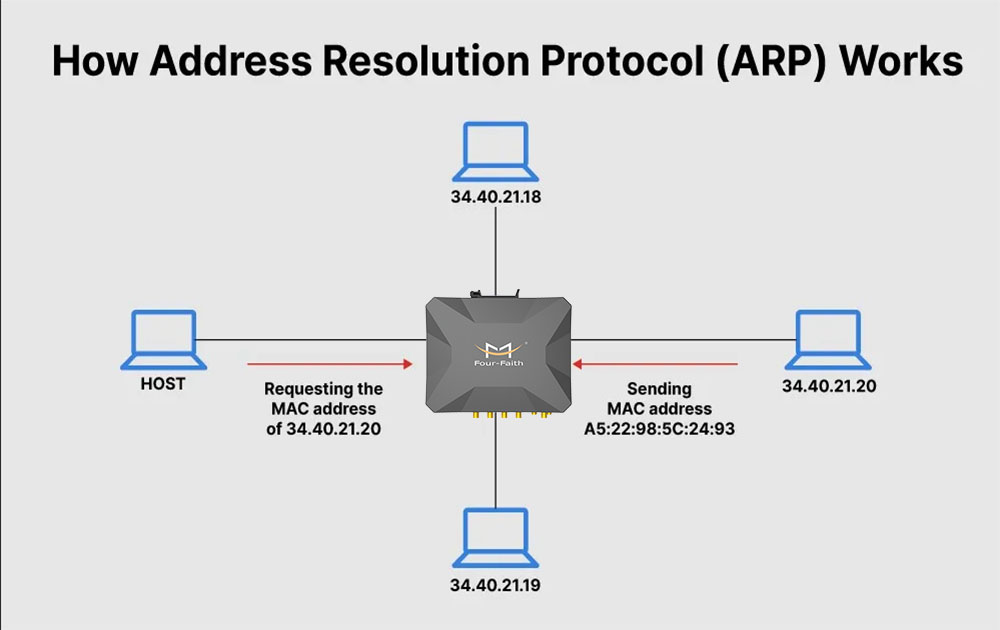

## Introduction
L'ARP spoofing est une technique d'attaque sophistiquée qui exploite le protocole ARP, un élément fondamental des réseaux Ethernet. En manipulant ce protocole, un attaquant peut rediriger le trafic sur un réseau local, créant ainsi une série de risques et de vulnérabilités. Cette introduction a pour but de poser les bases de l'ARP spoofing, de ses mécanismes, de ses implications et de la manière de le détecter et de le prévenir.

## Fonctionnement ARP
Le protocole **ARP** (Address Resolution Protocol) est utilisé pour associer une adresse IP à une adresse MAC sur un réseau local. Lorsqu'une machine souhaite communiquer avec une autre sur le même réseau, elle doit connaître son adresse MAC. Si elle ne la connaît pas, elle envoie une requête ARP.

## ARP Spoofing
L'**ARP spoofing**, également connu sous le nom de **ARP poisoning**, est une technique d'attaque dans laquelle un individu malveillant envoie de fausses réponses ARP (Address Resolution Protocol) sur un réseau local. Ces réponses falsifiées peuvent permettre à l'attaquant d'associer sa propre adresse MAC (Media Access Control) à l'adresse IP (Internet Protocol) d'une autre machine sur le réseau. En conséquence, tout le trafic destiné à l'adresse IP cible est redirigé vers l'attaquant, permettant l'interception, la modification ou même le blocage des données. L'ARP spoofing peut être utilisé pour l'écoute clandestine, le man-in-the-middle (MITM) ou les attaques de déni de service (DoS), et représente une menace sérieuse pour la sécurité et l'intégrité des communications sur un réseau local.

## Implications et Conséquences
- **Interception de Données** : l'attaquant peut écouter toutes les données transmises entre les machines, y compris les informations sensibles comme les mots de passe et les détails financiers.
- **Modification de Données** : l'attaquant peut non seulement écouter mais aussi modifier les données en transit, créant des possibilités de fraude et de désinformation.
- **Indisponibilité** : en bloquant la communication entre les machines, l'attaquant peut rendre les services inaccessibles, ce qui peut avoir un impact sur les opérations commerciales.

## Comment Découvrir si un SI y est Vulnérable
- **Analyse du Réseau** : Des outils comme **Wireshark** peuvent être utilisés pour surveiller le trafic ARP et détecter des anomalies, telles que des réponses ARP multiples pour une même adresse IP.
- **Scanners de Sécurité** : Des scanners spécialisés peuvent être utilisés pour tester la vulnérabilité à l'ARP spoofing, fournissant ainsi un rapport détaillé sur les risques potentiels. Par exemple : [XArp](https://xarp.net/)

## Exploitation
L'attaquant, étant sur le même réseau local (non pas par exemple sur un VLAN VPN), peut envoyer des réponses ARP non sollicitées, associant son adresse MAC à l'adresse IP d'une autre machine. Cela conduit les autres machines à envoyer le trafic destiné à l'adresse IP cible à l'attaquant.

Outils d'Attaque
Des outils spécifiques comme `Arpspoof` peuvent être utilisés pour lancer l'attaque, permettant à l'attaquant de spécifier les cibles et de contrôler le trafic.

Voici un tutoriel détaillé qui explique le déroulement d'une attaque : 
- https://tutorialedge.net/security/arp-spoofing-for-mitm-attack-tutorial/

## Prévention et Atténuation

- **Tables ARP Statiques** : il est possible de mapper statiquement toutes les adresses MAC d'un réseau à leurs adresses IP respectives. Cette méthode est très efficace pour prévenir les attaques d'ARP Poisoning, mais elle ajoute une charge administrative énorme. Tout changement dans le réseau nécessitera des mises à jour manuelles des tables ARP sur tous les hôtes, rendant les tables ARP statiques irréalisables pour la plupart des grandes organisations. Néanmoins, dans des situations où la sécurité est cruciale, créer un segment de réseau séparé où les tables ARP statiques sont utilisées peut aider à protéger les informations critiques.

- **Sécurité des Switchs**
    - La plupart des switchs Ethernet gérés disposent de fonctionnalités conçues pour atténuer les attaques d'ARP Poisoning. Généralement connues sous le nom de **Dynamic ARP Inspection** (DAI), ces fonctionnalités évaluent la validité de chaque message ARP et rejettent les paquets qui semblent suspects ou malveillants. Le DAI peut également être configuré pour limiter le taux auquel les messages ARP peuvent passer à travers le switch, empêchant ainsi efficacement les attaques de déni de service (DoS).
    - Le DAI et des fonctionnalités similaires étaient autrefois exclusives aux équipements réseau haut de gamme, mais sont maintenant courantes sur presque tous les switchs professionnels, y compris ceux des petites entreprises. Il est généralement considéré comme une meilleure pratique d'activer le DAI sur tous les ports, sauf ceux connectés à d'autres switchs. La fonctionnalité n'introduit pas d'impact significatif sur les performances, mais peut nécessiter d'être activée conjointement avec d'autres fonctionnalités comme le **DHCP Snooping** (une fonctionnalité de sécurité disponible sur de nombreux commutateurs de réseau gérés qui agit comme un pare-feu entre les clients DHCP non fiables et les serveurs DHCP fiables. Il fonctionne en examinant les paquets DHCP échangés entre les clients et les serveurs, et en filtrant les réponses non autorisées ou malveillantes).
    - Activer la Sécurité des Ports sur un switch peut également aider à atténuer les attaques d'ARP Cache Poisoning. La Sécurité des Ports peut être configurée pour n'autoriser qu'une **seule** adresse MAC sur un port de switch, privant ainsi un attaquant de la possibilité d'assumer malicieusement plusieurs identités réseau.

- **Sécurité Physique** : contrôler correctement l'accès physique à votre lieu d'affaires peut aider à atténuer les attaques d'ARP Poisoning. Les messages ARP ne sont pas routés au-delà des limites du réseau local, donc les attaquants potentiels doivent être à proximité physique du réseau victime ou avoir déjà le contrôle d'une machine sur le réseau. Notez que dans le cas des réseaux sans fil, la proximité ne signifie pas nécessairement que l'attaquant a besoin d'un accès physique direct ; un signal s'étendant jusqu'à une rue ou un parking peut suffire. Qu'il s'agisse de réseaux filaires ou sans fil, l'utilisation de technologies comme 802.1x peut garantir que seuls les appareils de confiance et/ou gérés peuvent se connecter au réseau.

- **Isolation du Réseau** : Comme indiqué précédemment, les messages ARP ne voyagent pas au-delà du sous-réseau local. Cela signifie qu'un réseau bien segmenté peut être moins susceptible au poisonning de cache ARP, car une attaque dans un sous-réseau ne peut pas affecter les appareils dans un autre. Concentrer les ressources importantes dans un segment de réseau dédié où une sécurité renforcée est présente peut grandement réduire l'impact potentiel d'une attaque d'ARP Poisoning.

- **Chiffrement** : bien que le chiffrement n'empêche pas réellement une attaque ARP de se produire, il peut en atténuer les dommages potentiels. Une utilisation populaire des attaques de type homme du milieu (MiTM) était de capturer les identifiants de connexion autrefois couramment transmis en clair. Avec l'utilisation généralisée du chiffrement SSL/TLS sur le web, ce type d'attaque est devenu plus difficile. L'acteur de la menace peut toujours intercepter le trafic, mais ne peut rien faire avec celui-ci sous sa forme chiffrée.

## Quel Contexte de Pentest n'est Pas Adapté à ce Genre d'Attaques
- **Accès VPN Seul** : si l'attaquant n'a qu'un accès VPN au réseau, il ne sera pas sur le même réseau local et ne pourra donc pas lancer une attaque ARP spoofing.

- **Réseaux Fortement Segmentés** : dans des réseaux où la segmentation est strictement appliquée, l'ARP spoofing peut être moins efficace, car l'attaquant n'a accès qu'à une petite partie du réseau.