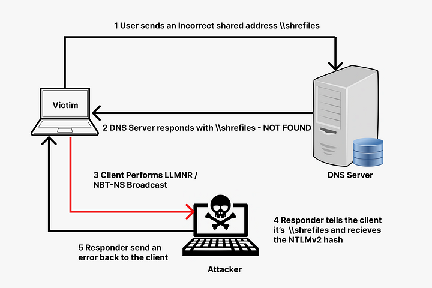

# Introduction

Le LLMNR (Link-Local Multicast Name Resolution) est un protocole qui permet aux ordinateurs d'un réseau local de résoudre les noms d'autres ordinateurs sans avoir besoin d'un serveur DNS. Bien que pratique, ce protocole présente des vulnérabilités qui peuvent être exploitées par des attaquants. L'une de ces vulnérabilités est le LLMNR poisoning. Cet article explore cette vulnérabilité en détail.

# Fonctionnement

Le LLMNR poisoning se produit lorsque l'attaquant répond à une requête LLMNR avant l'hôte légitime. Cela permet à l'attaquant de rediriger le trafic vers une machine contrôlée, souvent pour capturer des informations sensibles.

1. **Requête LLMNR** : Un client envoie une requête LLMNR pour résoudre un nom d'hôte.
2. **Réponse empoisonnée** : L'attaquant intercepte la requête et envoie une réponse empoisonnée avec l'adresse IP de sa machine.
3. **Redirection du trafic** : Le client envoie le trafic à l'adresse IP de l'attaquant, révélant potentiellement des informations sensibles.

# Implications et conséquences

Le LLMNR poisoning peut avoir de graves conséquences:

- **Vol d'informations** : L'attaquant peut capturer des identifiants, des mots de passe et d'autres données sensibles.
- **Attaques Man-in-the-Middle (MitM)** : L'attaquant peut modifier le trafic entre deux parties sans qu'elles le sachent.
- **Propagation dans le réseau** : L'attaquant peut utiliser les informations capturées pour se déplacer latéralement dans le réseau.

# Comment découvrir si un SI y est vulnérable
Pour découvrir si un système d'information (SI) est vulnérable au LLMNR poisoning, vous pouvez:

- Utiliser des outils de scanning comme Nmap avec des scripts spécifiques comme `llmnr-resolve`
- Suite à un scan PingCastle, il est possible de détecter si le LLMNR est activé.

# Comment ça s'exploite

L'exploitation du LLMNR poisoning peut être réalisée avec des outils comme Responder ou Metasploit. Le processus typique comprend:

- Écoute des requêtes LLMNR sur le réseau.
- Envoi de réponses empoisonnées.
- Capture et analyse du trafic redirigé.
- Prévention et atténuation

Globalement, ceci passe par l'utilisation de `responder` qui permet de lancer un poisoner et renvoyer par la suite des identifiants dès que c'est rentré par l'utilisateur.
On va par la suite recevoir le hash NTLMv2 écrit sur le disque, avec les ressources et le temps nécessaire, il est possible de craquer ce dernier avec `Hashcat`.

# Prévenir le LLMNR poisoning

- **Désactiver LLMNR** : La meilleure façon d'éviter une attaque de LLMNR poisoning est de désactiver le protocole LLMNR sur votre réseau. Si vous n'utilisez pas ce service, il n'est pas nécessaire de prendre ce risque de sécurité supplémentaire. Si vous avez besoin de cette fonctionnalité, le protocole Domain Name System (DNS) est une alternative plus sûre.

- **Exiger le contrôle d'accès réseau (Network Access Control)** : Le contrôle d'accès réseau empêche les attaques de LLMNR poisoning en appliquant des politiques de sécurité strictes et des mesures de contrôle d'accès sur tous les appareils du réseau. Il peut détecter et bloquer les appareils non autorisés et fournir une surveillance et des alertes en temps réel. Il peut également limiter la surface d'attaque en appliquant la segmentation du réseau.

- **Mettre en œuvre la segmentation du réseau** : Vous pouvez limiter la portée des attaques de LLMNR Poisoning en divisant votre réseau en sous-réseaux plus petits. Cela peut être réalisé grâce à l'utilisation de VLAN, de pare-feu et d'autres mesures de sécurité réseau.

- **Utiliser des mots de passe forts** : Dans le cas où une attaque de LLMNR Poisoning se produit, il est conseillé d'utiliser des mots de passe forts qui ne peuvent pas être facilement craqués. Les mots de passe faibles peuvent être facilement devinés ou existent déjà dans une table de dictionnaire ou une liste de mots de passe.

Il faut aussi garder en tête, que normalement, comme expliqué sur le schéma précédent, ce qui arrive théoriquement c'est : 
Echec sur le DNS => Envoie sur le LLMNR et si echec dessus => Envoi sur du NBT-NS.
NBT-NS est aussi vulnérable au NBT-NS poisoning, il est donc recommandé de le désactiver.

- **Désactiver NetBios** : 
    - Ouvrez le Panneau de configuration \ Réseau et Internet \ Connexions réseau et partage
    - Faites un clic droit sur l'interface réseau, sélectionnez les propriétés, puis double-cliquez sur "Internet Protocol Version 4 TCP/IPv4"
    - Dans la fenêtre suivante, cliquez sur "Avancé", puis sélectionnez l'onglet WINS
    - Sélectionnez ensuite l'option "Disable Netbios over TCP/IP" (Désactiver Netbios sur TCP/IP)

# Quel contexte de pentest n'est pas adapté à ce genre d'attaques

Le LLMNR poisoning nécessite généralement un accès au réseau local. Par conséquent, dans des contextes où l'accès est limité, comme un accès VPN sans accès complet au réseau interne, cette attaque peut ne pas être applicable.

# Conclusion

Le LLMNR poisoning est une vulnérabilité sérieuse qui peut avoir des conséquences dévastatrices. Comprendre son fonctionnement, ses implications et comment le prévenir est essentiel pour la sécurité d'un réseau. Cet article a fourni une vue d'ensemble complète et exhaustive de cette vulnérabilité, couvrant tous les aspects pertinents pour les professionnels de la sécurité et les administrateurs réseau.