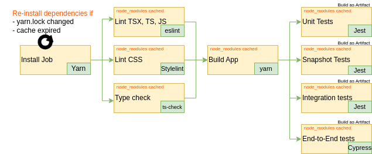

## Introduction
L'**intégration continue** (CI) est devenue un élément essentiel du cycle de développement de logiciels moderne. Elle permet aux équipes de développement de travailler de manière plus agile et efficace, en automatisant une grande partie du processus de test et de déploiement. Cet article explore en profondeur la CI, son importance, ses avantages, les outils disponibles, les étapes nécessaires, et les meilleures pratiques.

## Définition
L'**intégration continue** (CI) est une pratique de développement logiciel où les développeurs fusionnent leurs changements dans la branche principale aussi souvent que possible, généralement plusieurs fois par jour. Chaque fusion est vérifiée par une compilation automatique et des tests automatisés pour détecter les erreurs le plus tôt possible.

## Importance de la CI
L'intégration continue joue un rôle crucial dans le développement de logiciels pour plusieurs raisons:

- **Détection Rapide des Erreurs** : La CI permet de détecter les erreurs tôt dans le cycle de développement en exécutant des tests automatisés à chaque fusion. Cela permet de repérer les problèmes avant qu'ils ne s'aggravent, réduisant ainsi le temps et les efforts nécessaires pour les corriger.

- **Collaboration Améliorée** : En intégrant régulièrement le code, les équipes peuvent travailler plus étroitement et éviter les conflits de fusion. Cela favorise une meilleure communication et une collaboration plus efficace entre les développeurs, les testeurs et les opérateurs.

- **Livraison Continue** : La CI facilite la livraison et le déploiement continus en automatisant le processus de construction, de test et de déploiement. Cela permet une mise sur le marché plus rapide et une réponse plus agile aux besoins des clients.

## Avantages et défis de l'intégration continue

### Avantages
L'intégration continue est un aspect essentiel de [DevOps](https://www.atlassian.com/devops/what-is-devops) et des équipes de développement logiciel performantes. Cependant, les avantages de la CI ne se limitent pas à l'équipe d'ingénierie, mais profitent grandement à l'ensemble de l'organisation. La CI permet une meilleure transparence et une meilleure compréhension du processus de développement et de livraison de logiciels. Ces avantages permettent au reste de l'organisation de mieux planifier et exécuter les stratégies de mise sur le marché. Voici quelques-uns des avantages organisationnels globaux de la CI.

- **Permettre la mise à l'échelle** : La CI permet aux organisations de mettre à l'échelle la taille de l'équipe d'ingénierie, la taille de la base de code et l'infrastructure. En minimisant la bureaucratie et la communication liées à l'intégration du code, la CI aide à construire des flux de travail DevOps et agiles. Elle permet à chaque membre de l'équipe de posséder un changement de code jusqu'à sa publication. La CI permet la mise à l'échelle en supprimant toute dépendance organisationnelle entre le développement de fonctionnalités individuelles. Les développeurs peuvent désormais travailler sur des fonctionnalités dans un silo isolé et avoir l'assurance que leur code s'intégrera sans problème avec le reste de la base de code, ce qui est un processus DevOps central.

- **Améliorer la boucle de feedback** : Un feedback plus rapide sur les décisions commerciales est un autre effet puissant de la CI. Les équipes produit peuvent tester des idées et itérer plus rapidement les conceptions de produits avec une plateforme CI optimisée. Les changements peuvent être rapidement poussés et mesurés pour le succès. Les bugs ou autres problèmes peuvent être rapidement identifiés et réparés.

- **Améliorer la communication** : La CI améliore la communication et la responsabilité globales en ingénierie, ce qui permet une plus grande collaboration entre le développement et les opérations au sein d'une équipe DevOps. En introduisant des flux de travail de pull request liés à la CI, les développeurs bénéficient d'un partage passif des connaissances. Les pull requests permettent aux développeurs d'observer et de commenter le code des autres membres de l'équipe. Les développeurs peuvent désormais voir et collaborer sur les branches de fonctionnalités avec d'autres développeurs à mesure que les fonctionnalités progressent dans la pipeline CI. La CI peut également être utilisée pour aider à réduire les dépenses en ressources QA. Un pipeline CI efficace avec une couverture de test automatisée de haute confiance protégera contre les régressions et garantira que les nouvelles fonctionnalités correspondent à une spécification. Avant que le nouveau code ne soit fusionné, il doit passer la suite de tests d'assertion CI qui empêchera toute nouvelle régression.


### Défis de la CI
Les avantages de la CI l'emportent largement sur les défis de son adoption. Cela dit, il est important d'être conscient des défis de la CI. Les véritables défis de la CI surviennent lors de la transition d'un projet sans CI vers la CI. La plupart des projets logiciels modernes adopteront la CI dès les premières étapes de la conception et atténueront les défis d'une adoption ultérieure.

- **Adoption et installation** : les défis de l'intégration continue concernent principalement l'adoption par l'équipe et l'installation technique initiale. Si une équipe n'a pas actuellement de solution CI en place, il peut être nécessaire de faire des efforts pour en choisir une et commencer. Ainsi, des considérations doivent être prises en compte concernant l'infrastructure d'ingénierie existante lors de l'installation d'un pipeline CI.

- **Courbe d'apprentissage technologique** : la fonctionnalité CI s'accompagne d'une liste de technologies de support qui peuvent être des investissements en courbe d'apprentissage pour l'équipe à entreprendre. Ces technologies sont les systèmes de contrôle de version, l'infrastructure d'hébergement et les technologies d'orchestration.

## Open Source Tools for CI

- **Jenkins** : Il offre une grande flexibilité et une vaste bibliothèque de plugins. Il peut être configuré pour exécuter des tests, compiler le code, et déployer des applications, le tout de manière automatisée.

- **GitLab CI** : Intégré à GitLab, il permet une configuration facile des pipelines CI/CD directement dans le référentiel de code, facilitant la collaboration et l'automatisation.

- **Travis CI** : Spécialement conçu pour travailler avec GitHub, il offre une intégration transparente et une configuration simple pour les projets hébergés sur GitHub.

- **CircleCI** : Il offre une intégration avec de nombreux systèmes de contrôle de version et une configuration facile, permettant une automatisation rapide et efficace.

## Étapes que toute CI doit contenir

- **Source Control** : Utiliser un système comme Git permet de suivre les changements et de faciliter la collaboration entre les membres de l'équipe.

- **Compilation Automatique** : La compilation automatique assure que le code est toujours dans un état constructible, réduisant les risques d'erreurs de compilation.

- **Tests Automatisés** : Les tests automatisés à chaque étape permettent de détecter rapidement les erreurs et d'assurer que le code répond aux exigences. (pour plus d'information sur le sujet, vous pouvez vous référez à [l'article](https://l1d1nsec.com/dev-posts/front-tests/) sur les tests automatisés)

- **Analyse de Code** : L'analyse automatique du code pour la qualité et les normes de codage aide à maintenir un code propre et efficace.

## Best Practices de la CI

- **Intégrer Régulièrement** : Fusionner fréquemment évite les conflits majeurs et facilite la collaboration.
- **Maintenir une Branche Principale Stable** : Assurer que la branche principale est toujours déployable réduit les risques et facilite la livraison continue.
- **Automatiser Tout** : L'automatisation de toutes les étapes, des tests au déploiement, assure une efficacité et une fiabilité maximales.
- **Utiliser des Environnements Identiques** : Avoir des environnements de test et de production identiques réduit les risques d'erreurs liées à l'environnement.
- **Fournir un Feedback Rapide** : Informer rapidement les développeurs des problèmes permet une correction rapide et une amélioration continue.
- **Pull Requests et Revue de Code** : les pull requests et la revue de code encouragent la collaboration et le partage des connaissances. Ils permettent une revue par les pairs du nouveau code, favorisant la communication au sein de l'équipe et protégeant contre la dette technique.
- **Optimiser la Vitesse de la Pipeline** : l'optimisation de la vitesse du pipeline CI est essentielle pour une boucle de feedback rapide. Une exécution plus rapide permet aux développeurs de pousser des changements rapidement, améliorant l'expérience utilisateur et offrant un avantage concurrentiel.

## Exemple de CI

Pour l'exemple, je vais montrer 3 CI différentes : **Gitlab CI**, **Github CI** et **Jenkins** pour le cadre d'une application web en **React.js** typé.
L'objectif est d'optimiser les runs et qu'un job n'est lancé que si on est sur qu'un autre ne sera pas lancé, ainsi on va réaliser d'abord l'analyse statique du code qui ne dépasse que rarement les 2-3 minutes si bien parallélisée, puis après on lance le build (pour s'assurer d'abord qu'il n'y aura pas d'erreur build suite à un problème sur le code qui aurait pu être découvert par l'analyse statique), par la suite on lance les différents tests à partir du build pour s'assurer qu'à minima les tests vont vérifier le build final et non une version du dev environment. L'objectif est d'assurer une bonne accuracy des tests.



### Github CI

Principalement sur le `.github/workflows/ci.yml`

```yaml
name: CI

on:
push:
    branches:
    - main

jobs:
# Installation des dépendances si le cache expire ou si yarn.lock change
install_dependencies:
    runs-on: ubuntu-latest
    steps:
    - name: Checkout code
        uses: actions/checkout@v2
    - name: Cache dependencies
        id: cache
        uses: actions/cache@v2
        with:
        path: node_modules
        key: ${{ runner.os }}-node-modules-${{ hashFiles('yarn.lock') }}
    - name: Install dependencies
        if: steps.cache.outputs.cache-hit != 'true'
        run: npm install

# Linting en parallèle
lint:
    needs: install_dependencies
    runs-on: ubuntu-latest
    strategy:
    matrix:
        task: [lint:jsx, lint:css, type-check]
    steps:
    - name: Checkout code
        uses: actions/checkout@v2
    - name: Use cached node_modules
        uses: actions/cache@v2
        with:
        path: node_modules
        key: ${{ runner.os }}-node-modules-${{ hashFiles('yarn.lock') }}
    - name: Run lint
        run: npm run ${{ matrix.task }}

# Construction de l'application
build:
    needs: lint
    runs-on: ubuntu-latest
    steps:
    - name: Checkout code
        uses: actions/checkout@v2
    - name: Use cached node_modules
        uses: actions/cache@v2
        with:
        path: node_modules
        key: ${{ runner.os }}-node-modules-${{ hashFiles('yarn.lock') }}
    - name: Build
        run: npm run build
    - name: Upload build artifact
        uses: actions/upload-artifact@v2
        with:
        name: build
        path: build

# Tests automatisés en parallèle
test:
    needs: build
    runs-on: ubuntu-latest
    strategy:
    matrix:
        task: [test:unit, test:snapshot, test:integration, test:e2e]
    steps:
    - name: Checkout code
        uses: actions/checkout@v2
    - name: Download build artifact
        uses: actions/download-artifact@v2
        with:
        name: build
        path: build
    - name: Run test
        run: npm run ${{ matrix.task }}
```

### Gitlab CI

Principalement sur le `.gitlab-ci.yml`

```yaml
stages:
- install
- lint
- build
- test

variables:
CACHE_KEY: "yarn-${CI_COMMIT_REF_SLUG}-${CI_PIPELINE_ID}"

# Installation des dépendances si le cache expire ou si yarn.lock change
install_dependencies:
stage: install
script:
    - npm install
cache:
    key: ${CACHE_KEY}
    paths:
    - node_modules/
    policy: pull-push
only:
    changes:
    - yarn.lock

# Linting du JSX
lint_jsx:
stage: lint
script:
    - npm run lint:jsx
dependencies:
    - install_dependencies

# Linting du CSS
lint_css:
stage: lint
script:
    - npm run lint:css
dependencies:
    - install_dependencies

# Vérification des types
type_check:
stage: lint
script:
    - npm run type-check
dependencies:
    - install_dependencies

# Construction de l'application
build:
stage: build
script:
    - npm run build
artifacts:
    paths:
    - build/

# Tests unitaires
unit_tests:
stage: test
script:
    - npm run test:unit
dependencies:
    - build

# Tests de snapshot
snapshot_tests:
stage: test
script:
    - npm run test:snapshot
dependencies:
    - build

# Tests d'intégration
integration_tests:
stage: test
script:
    - npm run test:integration
dependencies:
    - build

# Tests de bout en bout (End to End)
e2e_tests:
stage: test
script:
    - npm run test:e2e
dependencies:
    - build
```

### Jenkins

Principalement sur le `Jenkinsfile`

```jenkinsfile
pipeline {
    agent any

    stages {
        // Installation des dépendances si yarn.lock change
        stage('Install Dependencies') {
            when {
                changeset pattern: 'yarn.lock', comparator: 'CHANGE'
            }
            steps {
                sh 'npm install'
                stash includes: 'node_modules/', name: 'node_modules'
            }
        }

        // Linting en parallèle
        stage('Lint') {
            parallel {
                stage('Lint JSX') { // Linting du JSX
                    steps {
                        unstash 'node_modules'
                        sh 'npm run lint:jsx'
                    }
                }
                stage('Lint CSS') { // Linting du CSS
                    steps {
                        unstash 'node_modules'
                        sh 'npm run lint:css'
                    }
                }
                stage('Type Check') { // Vérification des types
                    steps {
                        unstash 'node_modules'
                        sh 'npm run type-check'
                    }
                }
            }
        }

        // Construction de l'application
        stage('Build') {
            steps {
                unstash 'node_modules'
                sh 'npm run build'
                archiveArtifacts artifacts: 'build/', fingerprint: true
            }
        }

        // Tests automatisés en parallèle
        stage('Automated Tests') {
            parallel {
                stage('Unit Tests') { // Tests unitaires
                    steps {
                        unstash 'build'
                        sh 'npm run test:unit'
                    }
                }
                stage('Snapshot Tests') { // Tests de snapshot
                    steps {
                        unstash 'build'
                        sh 'npm run test:snapshot'
                    }
                }
                stage('Integration Tests') { // Tests d'intégration
                    steps {
                        unstash 'build'
                        sh 'npm run test:integration'
                    }
                }
                stage('End to End Tests') { // Tests de bout en bout (End to End)
                    steps {
                        unstash 'build'
                        sh 'npm run test:e2e'
                    }
                }
            }
        }
    }
}
```