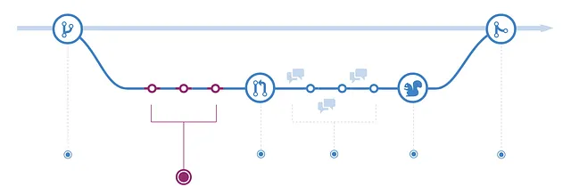
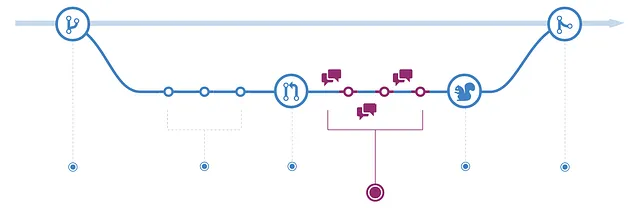
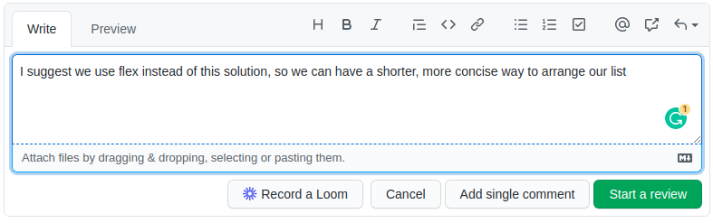

# Github Workflow

## Introduction

### Introduction
Dans le monde en constante évolution de la technologie et du développement logiciel, la collaboration et la gestion efficaces des projets sont essentielles. C'est là qu'intervient un workflow de travail GitHub, un système qui facilite la collaboration et la gestion de projets en permettant aux développeurs de travailler ensemble de manière plus organisée et transparente. Cette introduction explore la définition de Git, l'importance du versionnage de code et l'intérêt de fonctionner en workflow similaire.

### Définition de Git (Versionnage de Code)
Git est un système de contrôle de version distribué qui permet aux développeurs de suivre et de gérer les changements dans le code source au fil du temps. Contrairement à d'autres systèmes de contrôle de version, Git stocke les informations sous forme de snapshots du projet, et non de différences entre les fichiers. Cela permet une plus grande flexibilité et une collaboration plus efficace entre les membres de l'équipe, car chaque développeur peut travailler sur sa propre copie du projet et fusionner ses changements avec les autres.

### Intérêt de Versionner le Code et de Fonctionner en Workflow Similaire

- **Contrôle et Traçabilité** : versionner le code avec Git offre un contrôle sans précédent sur le développement. Chaque modification est enregistrée avec des détails tels que l'auteur, la date et une description, permettant une traçabilité complète. Cela facilite non seulement la détection et la correction des erreurs, mais aussi la compréhension de l'évolution du projet. Dans un environnement complexe où plusieurs développeurs collaborent, cette traçabilité est essentielle pour maintenir la cohérence et l'intégrité du code.

- **Collaboration et Parallélisation** : Git permet à plusieurs développeurs de travailler simultanément sur différentes branches, favorisant une parallélisation efficace des tâches. Cela élimine les goulots d'étranglement et permet une utilisation optimale des ressources de l'équipe. De plus, les conflits potentiels peuvent être résolus de manière élégante, sans compromettre le travail des autres.

- **Qualité et Revue de Code** : L'adoption d'un workflow structuré, tel que celui basé sur les Pull Requests, impose une discipline qui améliore la qualité du code. Chaque modification doit passer par une revue de code, où les pairs évaluent, critiquent et suggèrent des améliorations. Cela crée une culture de responsabilité et d'excellence, où les erreurs sont attrapées tôt et où les meilleures pratiques sont renforcées.

- **Flexibilité et Expérimentation** : Avec Git, les développeurs peuvent créer des branches pour expérimenter de nouvelles fonctionnalités sans affecter le code principal. Cela encourage l'innovation et permet d'explorer différentes solutions sans risque. Si une expérimentation réussit, elle peut être fusionnée ; si elle échoue, elle peut être abandonnée sans conséquence.

- **Intégration et Livraison Continues** : Un workflow Git bien conçu peut être intégré à des systèmes d'Intégration Continue (CI) et de Livraison Continue (CD), automatisant le processus de test et de déploiement. Cela accélère le cycle de développement, réduit les erreurs humaines et assure que le code est toujours dans un état déployable.


## Comment Utiliser les Pull Requests avec Git : Guide en 6 Étapes

Avant de commencer sa journée de développeur, il est toujours recommandé de pull la branche principale en local, ça permet d'abord d'avoir une meilleure vision des features déjà merge, et d'assurer que votre travail reste le plus synchronisé avec la `main` pour éviter de grands conflits sur le long terme.


### Étape 1: Créer une Nouvelle Branche

Avant d'apporter des modifications au code source, créez une nouvelle branche pour vos modifications. Cela vous permettra de travailler sur vos modifications sans affecter le code source principal.


```bash
git checkout -b my-feature-branch
```

### Étape 2: Apporter des Modifications et les Valider

Apportez vos modifications au code source et validez-les dans votre branche.



```bash
git add .
git commit -m "Ajout de nouvelle fonctionnalité"
```

### Étape 3-1: Pousser les Modifications vers la Branche Distante


Poussez vos modifications vers la branche distante sur GitHub.


```bash
git push origin my-feature-branch
```

### Étape 3-2: Créer une Pull Request

Créez une pull request sur GitHub pour fusionner vos modifications dans le code source principal.

### Étape 4: Examiner et Discuter des Modifications



Chaque membre de l'équipe doit effectuer des revues de **Pull Requests** en suivant les principes suivants :

#### Meilleures Pratiques pour la Revue de Code

La revue de code est une partie importante du processus de développement, et il y a plusieurs meilleures pratiques à garder à l'esprit lors de la revue de code :


1. **Soyez constructif et respectueux** : Lors de la revue du code de quelqu'un d'autre, il est important d'être respectueux et constructif dans vos commentaires. Évitez les attaques personnelles ou les critiques de l'auteur du code.




- **Concentrez-vous sur le code, pas sur l'auteur** : La revue de code vise à améliorer le code, et non à juger l'auteur/ Concentrez-vous sur le code lui-même et comment il peut être amélioré, plutôt que sur la personne qui l'a écrit.
- **Soyez précis et concret** : Lorsque vous fournissez des commentaires, soyez précis sur ce qui doit être changé et donnez des suggestions concrètes pour l'amélioration. Évitez les commentaires vagues qui ne fournissent aucune orientation.
- **Considérez l'objectif du code** : Lors de la revue de code, considérez son objectif et comment il s'inscrit dans le contexte plus large du projet. Assurez-vous que le code est conforme aux objectifs et aux normes du projet.
- **Soyez minutieux, mais ne chipotez pas** : Revoyez le code minutieusement, mais évitez de chipoter sur de petits détails qui n'affectent pas la fonctionnalité ou la lisibilité du code.

### Étape 5: Fusionner les Modifications dans le Code Source Principal


Une fois que votre code a été examiné et approuvé, vous pouvez fusionner vos modifications dans le code source principal.

```bash
git checkout main
git pull origin main
git merge my-feature-branch
git push origin main
```

C'est tout ! Vous avez utilisé avec succès le flux de travail de pull request avec Git pour collaborer sur un projet.
