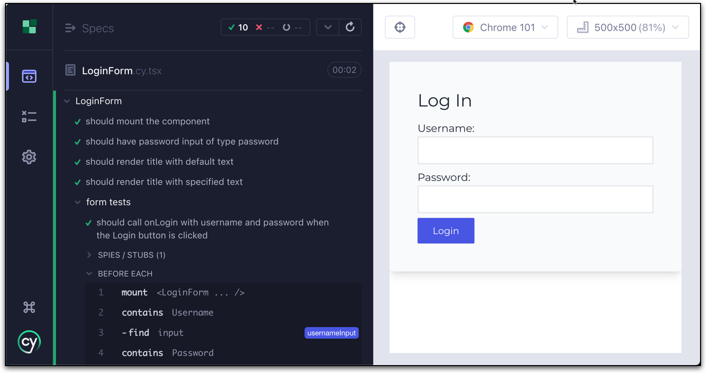

## Introduction

Dans l'univers du développement moderne, les tests sont devenus un élément indispensable pour garantir la qualité et la stabilité d'une application. Ils sont particulièrement cruciaux dans le développement frontend, où l'interaction avec l'utilisateur est au cœur de l'expérience. Cet article couvrira en détail pourquoi les tests sont nécessaires, les différents types de tests, la meilleure stratégie de test, les frameworks disponibles, l'automatisation et les particularités avec React.

## Pourquoi avoir des tests?

- **Assurance Qualité** : les tests permettent de s'assurer que le code fonctionne comme prévu et d'identifier rapidement les erreurs ou les défauts. Ils améliorent également la confiance des développeurs dans le code, facilitant ainsi les modifications et les ajouts futurs.
- **Régression** : Ils permettent de détecter les régressions, où une nouvelle modification casse une fonctionnalité existante.
- **Développement Agile** : Les tests soutiennent le développement agile, facilitant l'intégration et le déploiement continus.
- **Documentation** : Les tests peuvent servir de documentation vivante, décrivant comment le code doit fonctionner.

## Quels sont les différents types de test?

### Tests Unitaires
Les tests unitaires vérifient une unité de code individuelle, comme une fonction.

```javascript
    function add(a, b) {
    return a + b;
    }

    test('addition', () => {
        expect(add(1, 2)).toBe(3);
    });
```

### Tests d'Intégration
Ils vérifient comment plusieurs unités interagissent entre elles.

### Tests de bout en bout (E2E)
Ces tests vérifient l'application dans son ensemble, souvent en simulant une interaction utilisateur réelle.

## Quelle est la meilleure stratégie de test?

Il faut néanmoins garder en tête les points suivants : 
- **Adopter la pyramide de test** : Une grande base de tests unitaires, quelques tests d'intégration et encore moins de tests E2E.
- **Automatisation** : L'automatisation des tests permet un retour rapide.
- **Intégration Continue** : Intégrer les tests dans le pipeline CI/CD pour une vérification constante.
- **Maintenance** : Garder les tests à jour et réfléchir à l'objectif de chaque test.

## Quels sont les frameworks qui peuvent être utilisés pour tester

**JavaScript** :
- **[Jest](https://jestjs.io/)**: Très populaire pour les tests unitaires et d'intégration.
Caractéristiques :

    - **Facilité de configuration** : Jest est facile à mettre en place et vient avec une configuration par défaut.
    - **Snapshot Testing** : Cela permet de prendre un «instantané» de la sortie d'un composant et de le comparer lors des tests futurs.

Exemple de code :

```javascript
    test('adds 1 + 2 to equal 3', () => {
        expect(1 + 2).toBe(3);
    });
```


- **[Cypress](https://www.cypress.io/)**: Excellent pour les tests E2E. Caractéristiques :
    - **Interface utilisateur agréable** : Cypress fournit une interface qui montre les étapes du test en temps réel.
    - **Attentes automatiques** : Cypress attend automatiquement les éléments, les requêtes, etc., réduisant ainsi le flottement dans les tests.
    Facilité d'écriture: Les tests sont écrits dans un style semblable à Mocha.

Exemple de code:

```javascript
    cy.visit('https://example.com');
    cy.contains('Welcome').click();
```



- **[Mocha](https://mochajs.org/) & Chai** : Flexible et largement utilisé.
Caractéristiques:

    - **Flexible** : Ils peuvent être combinés avec d'autres bibliothèques et outils.
    - **Riche en fonctionnalités** : Ils fournissent un large éventail de façons d'écrire et de structurer les tests.
    - **Supporte plusieurs environnements** : Navigateur et Node.js.

Exemple de code:

```javascript
    describe('Array', () => {
        it('should return -1 when the value is not present', () => {
            expect([1, 2, 3].indexOf(4)).to.be(-1);
        });
    });
```

**[Python](https://www.python.org/)** (pour le test de code frontend via [Selenium](https://www.selenium.dev/)) :


- **PyTest** : Facilite l'écriture de petits tests.
Caractéristiques:

    - **Syntaxe simple** : Écrire des tests avec PyTest est clair et concis.
    - **Plugins riches** : Il existe de nombreux plugins pour étendre les fonctionnalités.
    - **Intégration avec Selenium** : Pour tester les applications Web frontend.

Exemple de code:

```python
    def test_valid_login():
        driver.get("https://example.com/login")
        assert "Login" in driver.title
```

- **unittest** : Bibliothèque de test intégrée dans Python.
Caractéristiques:

    - **Orienté objet** : Les tests sont écrits comme des classes et des méthodes.
    - **Ensemble complet** : Il fournit tout ce dont vous avez besoin pour écrire des tests.
    - **Intégration avec Selenium** : Facilite le test de l'interface utilisateur.

Exemple de code:

```python
    class TestLogin(unittest.TestCase):
        def test_valid_login(self):
            driver.get("https://example.com/login")
            self.assertIn("Login", driver.title)
```

## Est-ce qu'il y a des particularités avec React et les différents types de tests?

- **Tests unitaires** : Dans le développement React, les tests unitaires sont essentiels pour s'assurer que chaque composant fonctionne comme prévu.
    - **Enzyme** : Permet de manipuler, d'interagir et de simuler le rendu des composants React. Il propose trois types de rendu : superficiel, monté et statique.
    - **React Testing Library** : Encourage les tests qui se concentrent sur le comportement plutôt que sur l'implémentation, facilitant la maintenance des tests même après les refactorisations.


```javascript
    import { shallow } from 'enzyme';
    import MyComponent from './MyComponent';

    it('renders without crashing', () => {
        shallow(<MyComponent />);
    });
```

- **Snapshot Testing** : Les tests de snapshots sont utiles pour vérifier que l'interface utilisateur ne change pas de manière inattendue.
    - **Création d'instantanés** : Jest peut prendre un instantané de la structure d'un composant.
    - **Comparaison d'instantanés** : Lors des tests futurs, Jest compare l'instantané actuel avec l'instantané stocké. Si des différences sont détectées, le test échoue.

```javascript
    import renderer from 'react-test-renderer';
    import MyComponent from './MyComponent';

    it('renders correctly', () => {
        const tree = renderer.create(<MyComponent />).toJSON();
        expect(tree).toMatchSnapshot();
    });
```

- **Tests d'intégration** : Les tests d'intégration vérifient l'interaction entre différents composants et peuvent nécessiter des outils supplémentaires pour gérer l'état et le contexte.

```javascript
    import { render } from '@testing-library/react';
    import { Provider } from 'react-redux';
    import MyComponent from './MyComponent';
    import store from './store';

    test('can render with redux', () => {
        render(
            <Provider store={store}>
                <MyComponent />
            </Provider>
        );
    });
```

- En résumé :
    - **Les tests unitaires** garantissent que chaque composant fonctionne isolément.
    - **Le Snapshot Testing** assure que les changements inattendus dans l'interface utilisateur sont détectés.
    - **Les tests d'intégration** vérifient l'interaction entre les composants et peuvent nécessiter des outils pour gérer l'état et le contexte.

## Bonus : TDD = Test-Driven Development

Test-Driven Development (TDD), ou Développement Dirigé par les Tests, est une méthode de développement logiciel qui met l'accent sur la rédaction des tests avant même d'écrire le code source. C'est une pratique qui influence profondément la conception du code et qui peut améliorer la qualité et la maintenabilité du système.

### Introduction à la TDD
La TDD est une pratique de développement agile où les tests guident le développement. Elle suit un rythme cyclique basé sur trois étapes simples mais essentielles : Rouge, Vert, Refactorisation (Red, Green, Refactor en anglais).
Dans la TDD, la conception n'est pas fixée dès le départ. Au lieu de cela, elle émerge naturellement à mesure que le développement progresse. Chaque cycle de TDD, en ajoutant de petites fonctionnalités et en refactorisant constamment, permet à la structure du code de s'adapter et de se perfectionner. Cela favorise une architecture plus flexible et plus adaptée aux besoins réels du système.


### Les trois étapes de la TDD
- **Rouge (Red)** : Écrire un test qui échoue avant même de commencer à coder la fonctionnalité elle-même. Cela définit l'objectif à atteindre et assure que le test est correct et vérifiable.

- **Vert (Green)** : Écrire le code minimal nécessaire pour que le test réussisse. Cela peut inclure du code "malpropre" ou temporaire, tant que le test passe.

- **Refactorisation (Refactor)** : Améliorer le code sans changer son comportement externe. Cela inclut le nettoyage, la suppression de la duplication, et l'amélioration de la lisibilité.

Il faut garder en tête que la refactorisation n'est pas une étape optionnelle dans la TDD; c'est un élément essentiel. Après avoir écrit du code pour passer un test, la refactorisation permet d'examiner ce code et de le restructurer sans en changer le comportement. Cela implique souvent la suppression de la duplication, l'amélioration de la lisibilité, et l'optimisation de la performance. La refactorisation continue assure que le code reste propre et maintenable.


### Pourquoi la TDD ?

La TDD promeut une conception modulaire et une architecture propre, facilitant le développement continu et évolutif. Voici quelques avantages notables:

- **Définition claire des exigences** : Les tests, en tant que spécifications, définissent exactement ce que doit faire le code.
- **Développement incrémentiel** : Chaque cycle TDD produit une nouvelle fonctionnalité, permettant un développement progressif.
- **Réduction des bugs** : Les tests constants assurent que les régressions sont rapidement détectées.
- **Amélioration de la maintenabilité** : Un code bien testé est généralement plus facile à comprendre, à modifier et à étendre.

### Défis de la TDD
Bien que puissant, le TDD peut présenter des défis:

- **Courbe d'apprentissage** : Adopter le TDD peut être difficile pour ceux qui ne sont pas habitués à penser en termes de tests.
- **Complexité des tests** : Les tests trop compliqués peuvent devenir un fardeau plutôt qu'une aide.
- **Risque de sur-ingénierie** : Une mauvaise compréhension de la TDD peut entraîner une conception trop complexe et rigide.

### Double boucle de la TDD

La TDD fonctionne souvent en double boucle, où une boucle externe gère les tests d'acceptation à un niveau plus élevé, et une boucle interne se concentre sur les tests unitaires pour chaque fonctionnalité. Les tests d'acceptation assurent que le système dans son ensemble fonctionne selon les exigences, tandis que les tests unitaires vérifient chaque partie isolément. Ensemble, ces boucles guident le développement pour assurer la cohérence et l'alignement avec les objectifs du projet.
