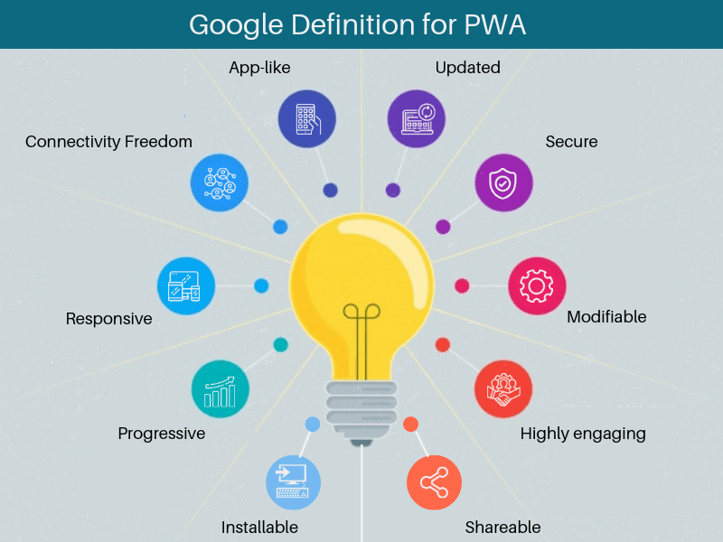

# Progressive Web Apps (PWA) : Exploration technique détaillée

## Introduction aux Progressive Web Apps

### Définition
Les Progressive Web Apps (PWA) sont des applications web qui utilisent les dernières technologies web pour offrir une expérience utilisateur similaire à celle des applications natives. Elles sont conçues pour fonctionner sur n'importe quelle plateforme qui utilise un navigateur compatible, offrant ainsi une expérience cohérente sur les appareils mobiles, les ordinateurs de bureau et autres.

### Pourquoi les PWA ?
Avec l'évolution rapide des technologies web, il est devenu possible d'offrir des expériences riches et engageantes directement dans le navigateur, sans nécessiter d'installation d'applications spécifiques. Les PWA combinent le meilleur des applications web et natives :

- **Accessibilité** : Les PWA sont accessibles via le navigateur, ce qui signifie qu'aucun téléchargement depuis un app store n'est nécessaire pour y accéder. Cependant, cela ne signifie pas qu'il n'y a pas de téléchargement du tout. Lorsque vous accédez à une PWA pour la première fois, les ressources nécessaires (comme les scripts, les images et les styles) sont téléchargées en arrière-plan et mises en cache pour une utilisation ultérieure.
- **Mise à jour** : Les PWA se mettent à jour automatiquement car elles récupèrent les nouvelles versions des ressources directement depuis le serveur web chaque fois qu'elles sont disponibles. Cela contraste avec les applications natives qui nécessitent souvent une mise à jour manuelle via un app store.
- **Indépendance du réseau** : Bien que les PWA soient accessibles via le navigateur, elles peuvent fonctionner hors ligne grâce aux service workers. Les service workers permettent de mettre en cache les ressources nécessaires, de sorte que même si vous n'avez pas de connexion Internet, la PWA peut toujours fonctionner avec les données mises en cache.
- **Sécurité** : Les PWA sont servies via HTTPS, ce qui garantit que les données sont cryptées pendant le transit et ne peuvent pas être altérées. Cela garantit une connexion sécurisée entre l'utilisateur et le serveur.

Il faut garder en tête, qu'en parlant d'application, on ne se limite pas à application mobile. Le principal avantage du PWA est la nature multiplateforme vu que souvent c'est des applications désignés pour être responsives.

### Caractéristiques clés

- **Responsive** : Les PWA s'adaptent à n'importe quelle taille d'écran, qu'il s'agisse d'un téléphone, d'une tablette ou d'un ordinateur de bureau.
- **Indépendance du réseau** : Grâce aux service workers, les PWA peuvent fonctionner hors ligne.
- **App-like** : Les PWA offrent une expérience similaire à celle des applications natives grâce à l'utilisation d'une shell d'application et à des interactions similaires à celles des applications.
- **Mises à jour fraîches** : Les mises à jour sont appliquées en arrière-plan grâce aux service workers.
- **Sécurisé** : Servi via HTTPS pour éviter les interceptions et garantir le contenu.
- **Découvrable** : Les PWA sont identifiables comme des "applications" grâce aux manifestes W3C et au service worker, permettant aux moteurs de recherche de les trouver.
- **Ré-engagement** : Les fonctionnalités comme les notifications push permettent de réengager facilement les utilisateurs.
- **Installable** : Les utilisateurs peuvent "garder" les PWA qu'ils trouvent les plus utiles sur leur écran d'accueil, sans passer par un app store.
- **Liens partageables** : Les PWA conservent la nature partageable du web, chaque page ayant son propre URL.




## Service Workers : Le cœur des PWA

### Qu'est-ce qu'un Service Worker ?
Un service worker est essentiellement un script JavaScript qui s'exécute en arrière-plan, indépendamment de la page web, ouvrant la voie à des fonctionnalités sans interaction utilisateur, telles que les notifications push et les mises à jour en arrière-plan. Il agit comme un proxy entre les applications web et le réseau, permettant de gérer et de contrôler efficacement les requêtes réseau.

### Cycle de vie du Service Worker
Le cycle de vie du service worker est un processus distinct du téléchargement d'une application depuis un app store, et est entièrement indépendant de la page web. Il comprend les étapes suivantes :


- **Enregistrement** : L'enregistrement est la première étape pour mettre en place un service worker. Cela signifie simplement que le navigateur est informé de l'existence du service worker et de l'endroit où il doit être utilisé. L'enregistrement ne télécharge pas l'ensemble de l'application, mais seulement le script du service worker.
- **Installation** : Après l'enregistrement, le navigateur tente d'installer le service worker. Pendant cette phase, le service worker peut mettre en cache certaines ressources pour une utilisation hors ligne. C'est cette mise en cache qui permet à la PWA de fonctionner même sans connexion Internet.
- **Activation** : Une fois que le service worker est installé, il est activé. Pendant cette phase, le service worker peut effectuer des tâches telles que la gestion des anciens caches.
- **Contrôle des clients** : Une fois activé, le service worker peut commencer à intercepter les requêtes et à les traiter. Cela signifie qu'il peut décider de renvoyer une ressource depuis le cache plutôt que depuis le réseau, permettant ainsi à la PWA de fonctionner hors ligne.


### Mise en cache par les workers

Les service workers agissent comme des proxy entre les applications web et le réseau. Ils sont capables d'intercepter et de contrôler les requêtes réseau, ce qui les rend essentiels pour la mise en cache des ressources dans les PWA.

- **Interception des requêtes** : Lorsqu'une application tente d'accéder à une ressource, le service worker intercepte cette demande. Il peut alors décider de la traiter de différentes manières.
- **Stratégies de mise en cache** : Il existe plusieurs stratégies courantes pour la mise en cache avec les service workers :
    - **Cache First** : Le service worker vérifie d'abord le cache. Si la ressource est présente, elle est renvoyée. Sinon, il effectue une requête réseau.
    - **Network First** : Le service worker tente d'abord d'obtenir la ressource du réseau. Si cela échoue (par exemple, en mode hors ligne), il se replie sur le cache.
    - **Cache then Network** : Le service worker répond d'abord depuis le cache, puis tente de récupérer la ressource depuis le réseau pour mettre à jour le cache.
- **Mise à jour du cache** : Les service workers peuvent également mettre à jour le cache en arrière-plan, garantissant que les utilisateurs disposent toujours des ressources les plus récentes.

### Manifeste d'application web
Le manifeste d'application web est essentiel pour définir comment la PWA doit se comporter lorsqu'elle est "installée" sur un appareil.


- **Définition** : C'est un fichier JSON qui contient des métadonnées sur la PWA. Il est référencé dans le code HTML de l'application via une balise <link>.
- **Propriétés clés** :
- `name` et `short_name` : Le nom complet et le nom abrégé de l'application.
- `icons` : Une liste d'icônes pour différents appareils et résolutions.
- `start_url` : L'URL à ouvrir lorsque l'application est lancée depuis l'écran d'accueil.
- `display` : Comment l'application doit être affichée (par exemple, en plein écran, autonome, etc.).
- `orientation` : Définit l'orientation préférée (portrait ou paysage).
- `background_color` et `theme_color` : Couleurs pour le splash screen et la barre d'adresse du navigateur.


Exemple de MAnifest d'une PWA fictive par exemple :

```json
{
  "name": "MyPhish - Sensibilisation au Phishing et Cybersécurité",
  "short_name": "MyPhish",
  "description": "Une application éducative pour vous aider à reconnaître et éviter les tentatives de phishing, tout en renforçant vos connaissances en matière de cybersécurité.",
  "lang": "fr",
  "start_url": "/index.html",
  "display": "standalone",
  "background_color": "#0A74DA",
  "theme_color": "#0A74DA",
  "orientation": "portrait-primary",
  "icons": [
    {
      "src": "/images/icons/icon-48x48.png",
      "sizes": "48x48",
      "type": "image/png"
    },
    {
      "src": "/images/icons/icon-96x96.png",
      "sizes": "96x96",
      "type": "image/png"
    },
    {
      "src": "/images/icons/icon-144x144.png",
      "sizes": "144x144",
      "type": "image/png"
    },
    {
      "src": "/images/icons/icon-192x192.png",
      "sizes": "192x192",
      "type": "image/png"
    },
    {
      "src": "/images/icons/icon-512x512.png",
      "sizes": "512x512",
      "type": "image/png"
    }
  ],
  "related_applications": [],
  "prefer_related_applications": false,
  "scope": "/app/",
  "serviceworker": {
    "src": "/sw.js",
    "scope": "/app/",
    "update_via_cache": "none"
  }
}
```

Explication : 

- `name` : Le nom complet de l'application "MyPhish - Sensibilisation au Phishing et Cybersécurité".
- `short_name` : Un nom abrégé "MyPhish" pour l'application, utilisé là où l'espace est limité.
- `description` : Une description de l'application qui met en avant son objectif éducatif sur le phishing et la cybersécurité.
- `background_color` et `theme_color` : Une couleur bleue qui peut évoquer la sécurité et la confiance.
- `icons` : Une liste d'icônes pour différents appareils et résolutions. Ces icônes pourraient avoir un design de bouclier ou de cadenas pour symboliser la sécurité.
- `related_applications` : Vide dans cet exemple, car il n'y a pas d'applications natives associées.
- `scope` et `serviceworker` : Informations standard sur la portée de l'application et le service worker associé.

## Avantages des PWA par rapport aux applications natives

- **Mises à jour instantanées** : Les PWA tirent parti des service workers pour mettre à jour les ressources en arrière-plan. Cela signifie que les utilisateurs n'ont pas à attendre ou à redémarrer l'application pour voir les mises à jour.
- **Indépendance du système d'exploitation** : Les PWA sont basées sur des standards web, ce qui les rend compatibles avec n'importe quel appareil doté d'un navigateur moderne, qu'il s'agisse d'Android, d'iOS, de Linux, de macOs  ou même de Windows pour ceux qui l'utilisent encore en **2023**.
- **Pas de processus d'examen d'application** : Sans la nécessité d'une soumission à un app store, les développeurs peuvent déployer des mises à jour dès qu'elles sont prêtes, sans attendre l'approbation d'une tierce partie.
- **Moins d'espace de stockage** : Les PWA stockent les données principalement dans le cache, ce qui signifie qu'elles n'ont pas besoin de réserver autant d'espace de stockage permanent que les applications natives.

## Limitations des PWA
- **Fonctionnalités du système d'exploitation** : Les PWA peuvent ne pas avoir accès à toutes les fonctionnalités du système d'exploitation, comme les contacts ou les capteurs avancés.
- **Performance** : Bien que les PWA soient généralement rapides, elles peuvent ne pas être aussi performantes que les applications natives pour certaines tâches.
- **Acceptation par les utilisateurs** : Les utilisateurs peuvent ne pas être aussi familiers avec les PWA que avec les applications natives, ce qui peut affecter leur acceptation.

## Intégration de PWA sur React


En créant votre application avec CRA, react par défaut crée un worker mais le désactive, pour l'activer il suffit de remplacer `serviceWorker.unregister()` par `serviceWorker.register()`.

Il faut aussi modifier le `public/manifest.json` pour refléter l'application comme déjà expliqué plus haut sur l'article.

Pour personnaliser tout le contenu, il faut plutôt passer par un outil du style [`workbox`](https://web.dev/learn/pwa/workbox/).

Une fois tout le développement terminé, et le déploiement est en préparation, il faut s'assurer que le fichier `service-worker.js` est prêt à être servit avec l'entête HTTP `service-worker`.