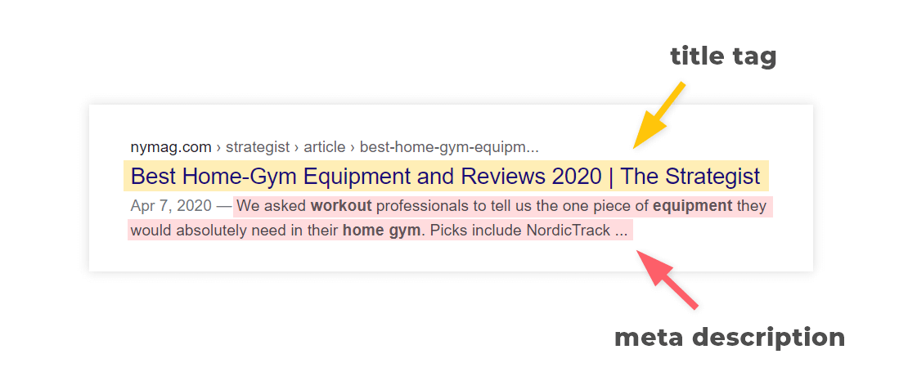
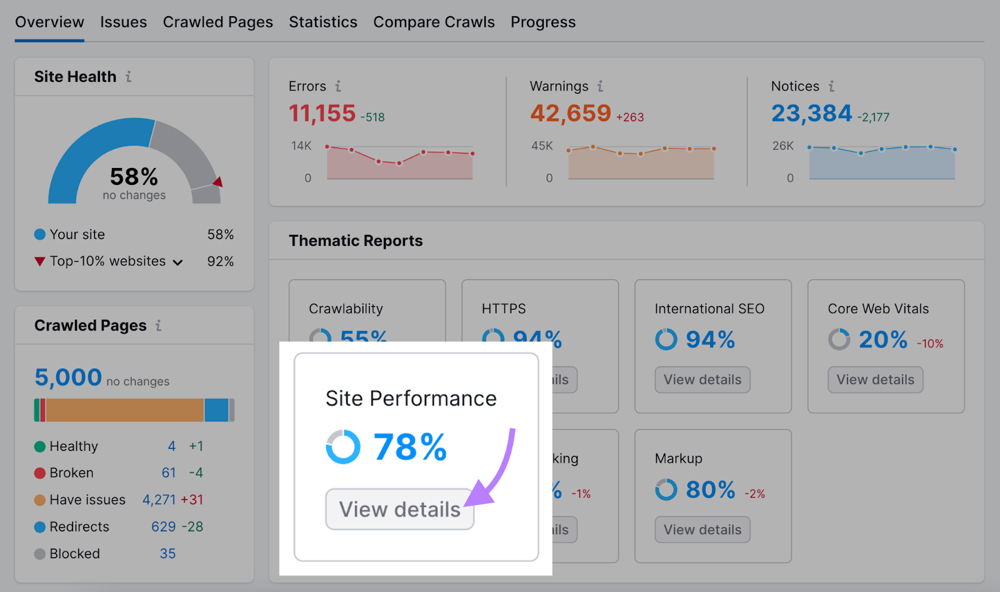

## Introduction

Le référencement naturel, plus communément appelé SEO (Search Engine Optimization), est l'art et la science de rendre les pages web attrayantes pour les moteurs de recherche. C'est bien plus qu'une simple optimisation pour les moteurs de recherche : c'est une véritable stratégie pour comprendre et répondre aux besoins des utilisateurs.

## Historiquement

### Un Bref Historique du SEO
Le SEO a débuté avec les premiers moteurs de recherche dans les années 1990. Depuis, il a évolué en parallèle avec les avancées technologiques et les changements d'algorithme des moteurs de recherche. Aujourd'hui, le SEO est une discipline complexe qui englobe la technique, le contenu, la structure des sites, la popularité et l'expérience utilisateur.

### Pourquoi le SEO est-il Essentiel ?
- **Visibilité** : Il permet à votre site d'apparaître dans les résultats de recherche pertinents.
- **Crédibilité** : Un site bien classé est souvent perçu comme plus fiable.
- **Trafic** : Le SEO augmente le trafic organique, souvent associé à un taux de conversion plus élevé.
- **Compétition** : Dans un monde numérique compétitif, le SEO est un avantage essentiel.

### Comment le SEO a Évolué ?
Le SEO est passé de la simple insertion de mots-clés à une discipline englobant la qualité du contenu, l'expérience utilisateur, la compatibilité mobile et bien d'autres aspects.

## Les Meilleures Pratiques SEO

- **Alignez Votre Contenu avec l'Intention de Recherche**
    - Comprenez l'intention derrière chaque requête de recherche.
    - Créez du contenu qui correspond à cette intention.
- **Utilisez des Mots-clés Principaux**
    - Chaque page doit cibler un mot-clé principal.
    - Utilisez ce mot-clé dans les éléments tels que le titre, les en-têtes et l'URL.
    - On peut se baser par exemple sur [le guide](https://www.semrush.com/blog/how-to-choose-keywords-for-seo/) de semrush par exemple.
- **Rédigez des Balises de Titre et des Méta-descriptions Convaincantes**
    - Utilisez des titres et des méta-descriptions attrayants et pertinents.
    - Incluez votre mot-clé principal.
    
- **Optimisez Vos Images**
    - Choisissez le bon format de fichier.
    - Compressez vos images.
    - Fournissez un texte alternatif (alt text).
    - Faites du lazy loading des images.
    
    - Il faut aussi garder en tête que Selon Google, les images WebP sans perte sont 26 % plus petites que les PNG et 34 % plus petites que les JPEG comparables.
- **Optimisez la Vitesse de Chargement de Votre Site**
    - Utilisez des outils comme Google PageSpeed Insights pour analyser et améliorer la vitesse de chargement.
    
- **Construisez une Structure de Lien Interne**
    - Utilisez des liens internes pour établir une hiérarchie d'informations.
    - Évitez les erreurs de liaison interne.
    - Il est aussi possible de voir l'internal linking et la structure à partir du résultat PageSpeed par exemple.
- **Améliorez l'Expérience Utilisateur (UX)**
    - Utilisez des en-têtes et des sous-en-têtes.
    - Rendez votre contenu visuellement attrayant.
    - Évitez les pop-ups intrusifs.
    - Rendez votre site mobile-friendly.
- **Rendez Vos URL SEO-Friendly**
    - Utilisez des URL courtes.
    - Incluez votre mot-clé cible.
    - Organisez vos URL de manière logique.
    
- **Construisez des Backlinks de Qualité**
    - Obtenez des backlinks de sites réputés.
    - Répliquez les stratégies de backlink de vos concurrents.
- **Créez un Contenu Utile**
    - Publiez du contenu original et utile.
    - Résolvez des problèmes complexes et partagez des perspectives uniques.

## Astuces Peu Connues
- **Optimisation pour la Recherche Vocale** : Adaptez votre contenu à la recherche vocale en ciblant des mots-clés conversationnels.
- **SEO Vidéo** : Transcrivez vos vidéos et optimisez les méta-descriptions pour améliorer leur visibilité.
- **Citations SEO Locales** : Assurez-vous que vos informations (Nom, Adresse, Numéro de téléphone) sont cohérentes sur toutes les plateformes.

## SEO pour React.js

## Outils pour Auditer le SEO
Google Analytics : Pour suivre le comportement des utilisateurs.
SEMrush : Pour l'analyse des concurrents et la recherche de mots-clés.
Moz : Pour l'analyse des liens et l'optimisation on-page.
Screaming Frog : Pour les audits SEO techniques.